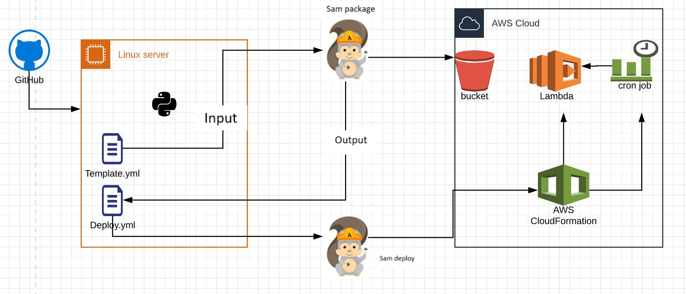
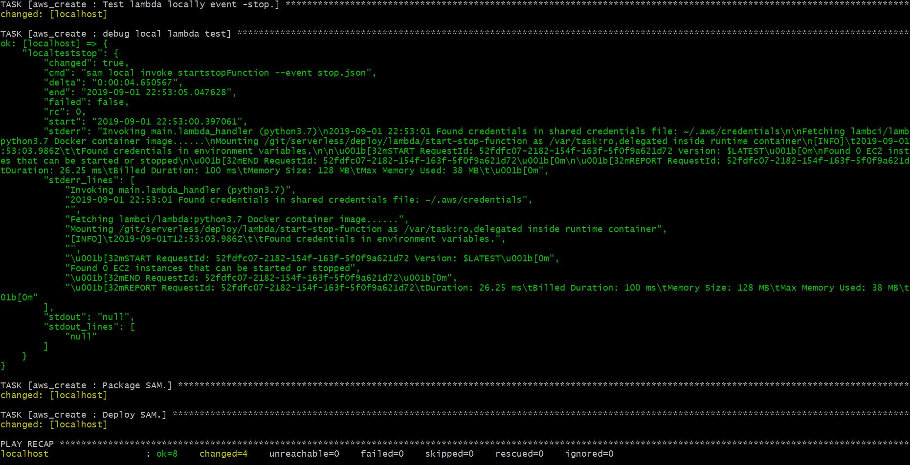

# Aim.
This repository contains AWS lambda function which is designed using SAM framework.

# Purpose

The purpose of this project is to build a automated lambda deployment framework using SAM.
Lambda built in this project is used to shut down ec2 instances during non-business hours.

The project uses ansible, github and AWS with pre-requisites to achieve the outcome.


# Project specific links
* [Github repository](https://github.com/testpurpose40/serverless.git)
* [Lambda function](https://github.com/testpurpose40/serverless/blob/master/deploy/lambda/start-stop-function/main.py)
* [Lambda role policy](https://github.com/testpurpose40/serverless/blob/master/deploy/lambda/ec2_startstop_role_policy.json)
* [Ansible yml for localized lambda testing  ](https://github.com/testpurpose40/serverless/blob/master/deploy/roles/aws_create/tasks/testlocal.yml)


## Limitations:

The project is deployed in single region for test purpose- ap-southeast-2. However it has capability to be deployed to other AWS regions. It is recommended to use CI-CD pipelines for easier deployment.

## Risk:

Ensure that you start/stop the right instances in the required region. Always test all scenarios before deploying in production.


# Instruction to run the project and workflow.

The project uses below workflow:




SAM uses ansible for deployment purpose. Localized automated docker for testing. It creates lambda function, cron job as per AEST hours in AWS. Any instances tagged as dev=true in ap-southeast-2 region are brought down at 5 pm and are started at 9 am Monday to Friday.

## Why ansible?

1. Low overhead- due to agentless model, Ansible reduces the overheads on the network by preventing the nodes from polling the controlling machine.
2. Secure and consistent- Ansible only uses SSH and Python on the managed nodes. This ensures safety and security. Also, Ansible ensures consistent environments.
3. Reliable- an Ansible playbook can be idempotent when written carefully. This prevents unexpected side-effects on the managed systems.
4. Good performance- Ansible delivers flawless performance. It is a powerful tool for deploying software applications.


## Pre-requisite

* Linux server.
* Git, ansible,brew and aws-sam-cli.
* IAM role with required privilege for lambda to run. Refer ec2_startstop_role_policy.json for    policy details.
* S3 bucket.
* Docker running locally.
* aws configured with required credentials.

1. Create directory '/git' using ec2-user

```
sudo mkdir /git

```

2. Clone the [github repository](https://github.com/testpurpose40/serverless.git)

```
git clone https://github.com/testpurpose40/serverless.git

```

3. Navigate to playbook path and run the ansible playbook.

```
cd /git/serverless/deploy
ansible-playbook aws_create.yml

```

You will see different tasks running. Wait for task completion. Once the task is completed, you can verify the function.

The ansible playbook has a task to test the lambda locally. You can view the local output response in the command line as below:




Do let me know in case of questions! 

# References

* [AWS SAM.](https://docs.aws.amazon.com/serverless-application-model/index.html)
* [AWS docs github.](https://github.com/awsdocs/aws-sam-developer-guide/tree/master/doc_source)


